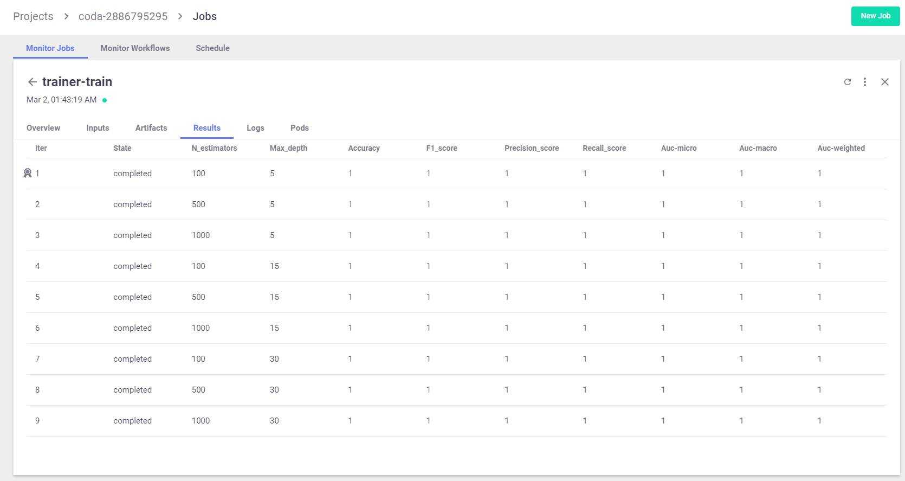

Please wait until the (pip) install is completed and MLRun DB/API service has started before moving forward !

> This setup include a local MLRun service, in order to work with a remote k8s cluster or [**Iguazio's platform**](https://www.iguazio.com/) you need to edit the 
> `remote.env`{{open}} file with the remote address and credentials and swap the environment using the call: 
> `mlrun.set_env_from_file("remote.env")` 

**Initialize MLRun Project and Generate Data**

load the MLRun project: 

`project = mlrun.load_project("./", init_git=True)`{{execute}}

run the data generation function `gen-iris` as we learned in the previous scenario:

`gen_data_run = project.run_function("gen-iris", local=True)`{{execute}}

**Train The Model**

Now, we wish to train a `RandomForestClassifier` model on our training data. For that, 
we wrote the following training function: `trainer.py`{{open}}

We execute our training function with specific data inputs and parameters, those will be recorded and versioned with our run. 
Our training function is already set in the project, so all we need to do is use our dataset from the `gen_data_run` outputs:

```python
trainer_run = project.run_function(
    "trainer", 
    inputs={"dataset": gen_data_run.outputs["dataset"]}, 
    params = {"n_estimators": 100, "max_depth": 5},
    local=True
)
```{{execute}}

The auto-logging for SciKit-Learn includes many plots and metrics. The metrics and artifacts are chosen according to the 
model algorithm used (classification or regression). You are able to add more metrics and artifacts and even write your 
own. To learn more about choosing metrics, artifacts and adding custom ones, we suggest reading more on MLRun's docs.

Print the metrics and artifacts generated automatically by the apply_mlrun()` method:

`pprint(trainer_run.outputs)`{{execute}}

Once the run is complete [**open the MLRun UI**](https://[[HOST_SUBDOMAIN]]-80-[[KATACODA_HOST]].[[KATACODA_DOMAIN]]/mlrun/projects/coda-[[HOST_SUBDOMAIN]]/jobs/monitor-jobs/) and see the generated artifacts and results




> All of the metrics and artifacts, are stored as metadata of our model itself, so it will be easy to do comparison 
> between models later on.
