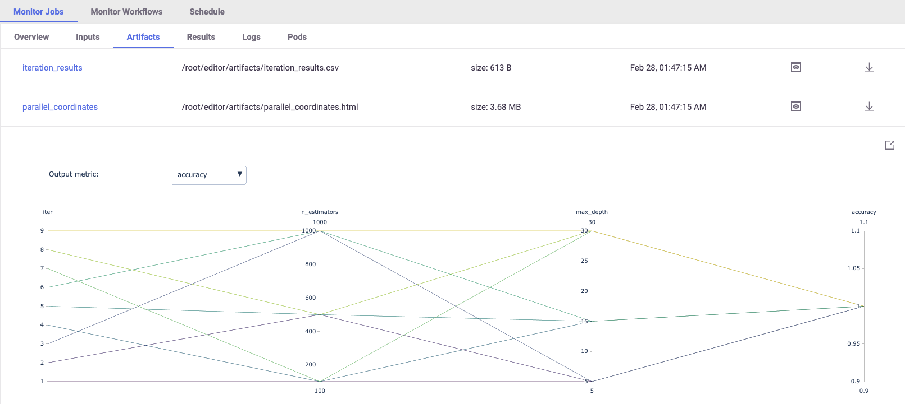

We will now multiple jobs in prallel for **hyperparameters tuning**. We will run a `GridSearch` with couple of 
parameters, select the best run with respect to the `max accuracy`. (read more about MLRun 
[Hyper-Param and Iterative jobs](https://docs.mlrun.org/en/latest/hyper-params.html)).

For basic usage we can run our hyperparameters tuning job by using the keywords arguments: 

* `hyperparams` for the hyperparameters options and values of choice.
* `selector` for specifying how to select the best model.

```python
hp_tuning_run = project.run_function(
    "trainer", 
    inputs={"dataset": gen_data_run.outputs["dataset"]}, 
    hyperparams={
        "n_estimators": [100, 500, 1000], 
        "max_depth": [5, 15, 30]
    }, 
    selector="max.accuracy", 
    local=True
)
```{{execute}}

The returned run object in this case represents the `parent` (and the **best** result), we can also access the 
individual child runs (called iterations in the MLRun UI).

## Review the Results

Let's review the results by printing the artifact `iteration_results`:

```print(hp_tuning_run.artifact("iteration_results").as_df().to_string())```{{execute}}

In addition, you can check our the parallel coordinates plot in the MLRun UI!


