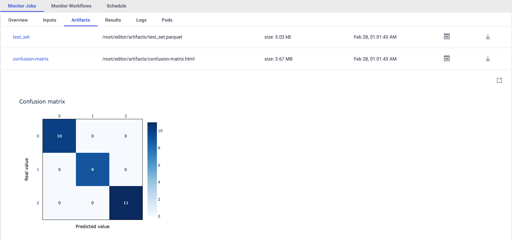
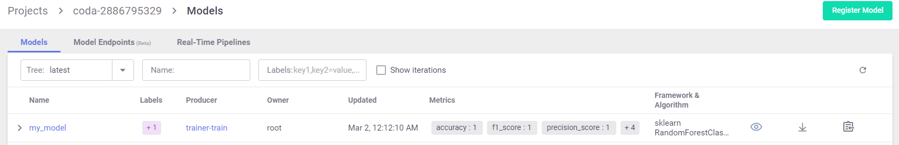

The auto-logging for SciKit-Learn includes many plots and metrics. The metrics and artifacts are chosen according to the 
model algorithm used (classification or regression). You are able to add more metrics and artifacts and even write your 
own. To learn more about choosing metrics, artifacts and adding custom ones, we suggest reading more on MLRun's docs.

Print the metrics and artifacts generated automatically by the apply_mlrun()` method:

`pprint(trainer_run.outputs)`{{execute}}

Once the run is complete [**open the MLRun UI**](https://[[HOST_SUBDOMAIN]]-80-[[KATACODA_HOST]].[[KATACODA_DOMAIN]]/mlrun/projects/coda-[[HOST_SUBDOMAIN]]/jobs/monitor-jobs/trainer-train) and see the artifacts and results



> All of the metrics and artifacts, are stored as metadata of our model, so it will be easy to do comparison 
> between models later on.

**Model Registry**

Models and their metadata are automatically stored in the **Model Registry**, check the
[**Model Artifacts Tab**](https://[[HOST_SUBDOMAIN]]-80-[[KATACODA_HOST]].[[KATACODA_DOMAIN]]/mlrun/projects/coda-[[HOST_SUBDOMAIN]]/models/models)
to see the models



Model objects can be read from MLRun DB and used in different applications, in the following example we list all 
model objects and print one as YAML, notice the amount of details automatically stored with the model (results, artifacts, statistics, schema, etc.)

```python
models = mlrun.get_run_db().list_artifacts(kind="model")
print(models.objects()[0].to_yaml())
```{{execute}}
