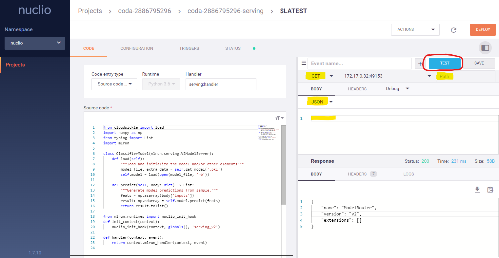

Once the function is ready and tested, we deploy it as a real-time serverless function (using Nuclio).

`function_address = serving_fn.deploy()`{{execute}}

[**Open the Nuclio UI**](https://[[HOST_SUBDOMAIN]]-8070-[[KATACODA_HOST]].[[KATACODA_DOMAIN]]/projects/coda-[[HOST_SUBDOMAIN]]/functions/coda-[[HOST_SUBDOMAIN]]-serving/code) 
to see the function and build progress, this may take a few minutes !.

> We can also save the function and deploy it later on another cluster, or deploy the function as part of a CI/CD pipeline.

Once the function is deployed we can make direct HTTP calls to it using the `invoke()` method,
here are couple of examples:

- get model metadata

`serving_fn.invoke("/v2/models/my_model", method="GET")`{{execute}}`

- Make prediction using `my_model` and the vectors in `my_data`

`serving_fn.invoke("/v2/models/my_model/infer", body=my_data)`{{execute}}`

> We can test the function from the [Nuclio UI](https://[[HOST_SUBDOMAIN]]-8070-[[KATACODA_HOST]].[[KATACODA_DOMAIN]]/projects/coda-[[HOST_SUBDOMAIN]]/functions/coda-[[HOST_SUBDOMAIN]]-serving/code), see the screenshot below 
> (need to update the fields marked in yellow and click on **test**):

