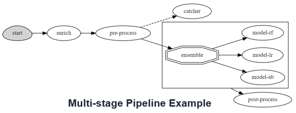

In this tutorial we build a simple model serving function with a `router` object and one or more models.
See the [Serving Graphs](https://docs.mlrun.org/en/stable/serving/serving-graph.html) documentation for more 
advanced topologies and multi-stage real-time pipelines.

We can use built-in (per framework) model server classes or define your own serving class ([**see documentation**](https://docs.mlrun.org/en/stable/serving/custom-model-serving-class.html)) which provides greater flexibility.

**Write a model serving class**

Model serving classes must inherit from `mlrun.serving.V2ModelServer`, and at the minimum implement the 
`load()` (download the model file(s) and load the model into memory) and `predict()` (accept request payload and 
return prediction/inference results) methods.

See the code of our `ClassifierModel` class in `serving.py`{{open}}

Model serving classes implement the full model serving functionality which include loading models, pre- and post-processing, 
prediction, explainability, and model monitoring. 

> [**MLRun Model Monitoring**](https://docs.mlrun.org/en/latest/model_monitoring/index.html) service only works in a full cluster deployment.
