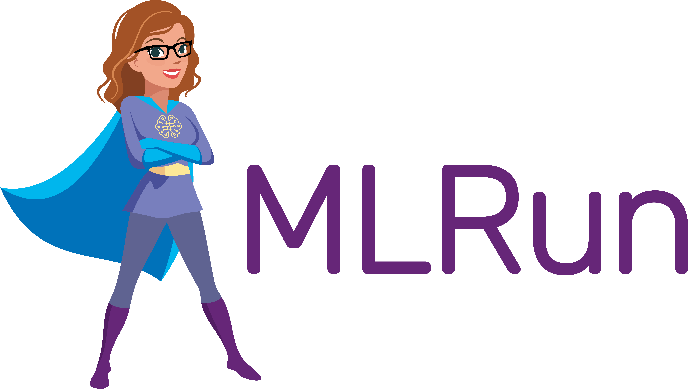

# Introduction

[MLRun](https://github.com/mlrun/mlrun) is an open-source MLOps framework that offers an integrative approach to managing your machine-learning pipelines from early development through model development to full pipeline deployment in production.

MLRun offers a convenient abstraction layer to a wide variety of technology stacks while empowering data engineers and data scientists to define the feature and models.

In the following course you will learn

- Setup MLRun on a Kubernetes Cluster
- Train, test and serve a Model

More information about MLRun and its architecture can be found [here](https://docs.mlrun.org/en/latest).
